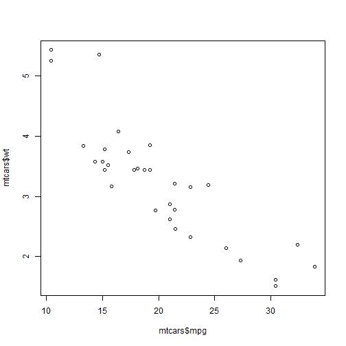

## Depending on the shape of data, it can be difficult to estimate the line of linear regression and how close the data are fitted.
# The published Shiny App allows the user to manipulate a coordinate upon which the line sits and the slope of the line, with feedback for $R^2$ value (a measure of fit).

Try the app at: https://krocco.shinyapps.io/DataProducts/

--- .class #id 

## Load Data and Plot

`mtcars` data is loaded and plotted as follows, showing the distribution of vehicle weight vs. miles per gallon:


```r
data(mtcars)
plot(mtcars$mpg, mtcars$wt)
```



It appears that the data is reasonably linear, so we can manipulate a linear regression line.

---

## Fit a Regression Line

The App takes input for X, Y, and slope. Then, using the equation for a line, the Y intercept is calculated to fully define the line in the form:
y = mx + b


```r
X <<- 20 
Y <<- 3.2
slope <<- -0.14
intercept <<- Y - slope*X
print(paste('y = ', slope, '* x + ', intercept))
```

```
## [1] "y =  -0.14 * x +  6"
```

The line can be plotted over the data.

---

## Calculate R^2

Once the guessed line is defined, R^2 is calculated and displayed for the user.


```r
Rsquared = 1 - sum((mtcars$wt - (slope * mtcars$mpg + intercept))^2)/sum((mtcars$wt - Y)^2)

print(paste('RSquared: ', round(Rsquared, 2)))
```

```
## [1] "RSquared:  0.75"
```

